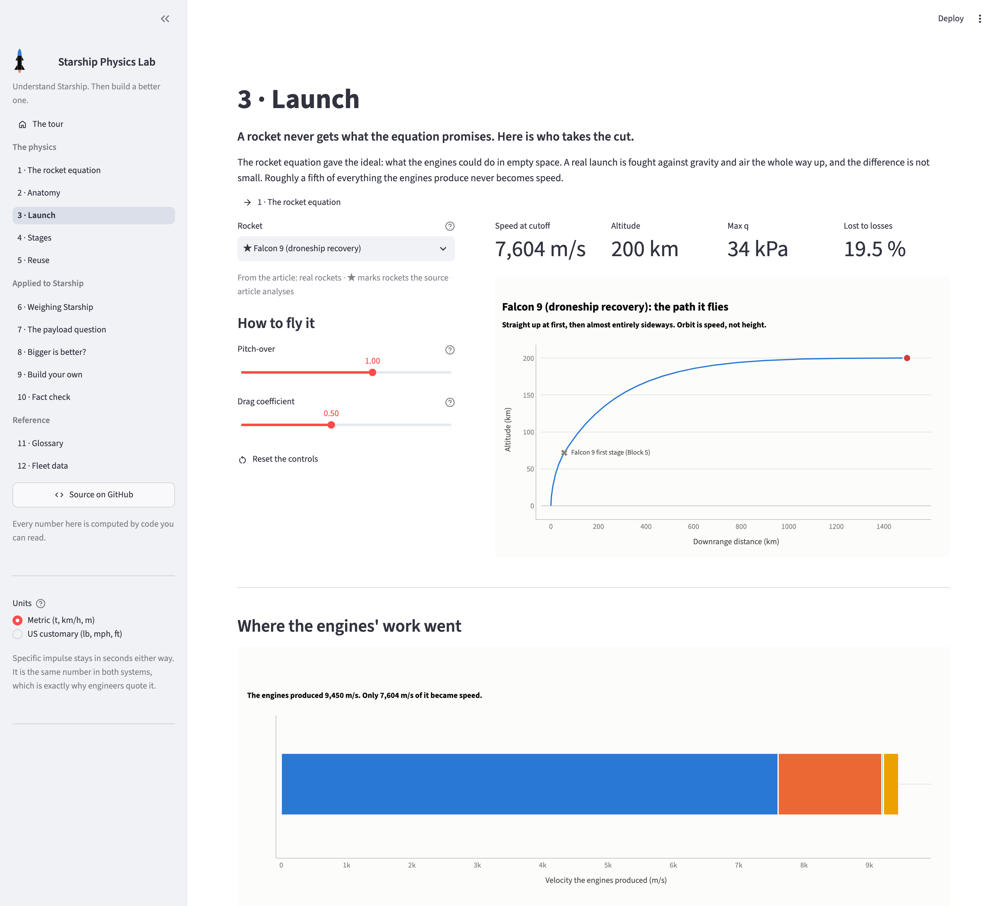
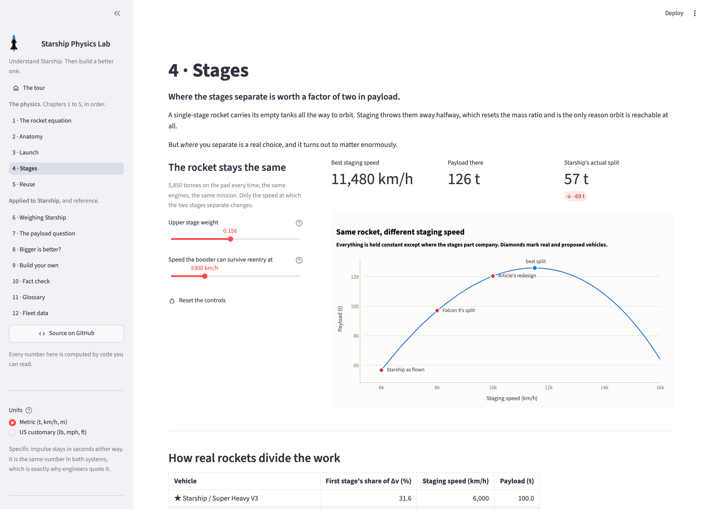
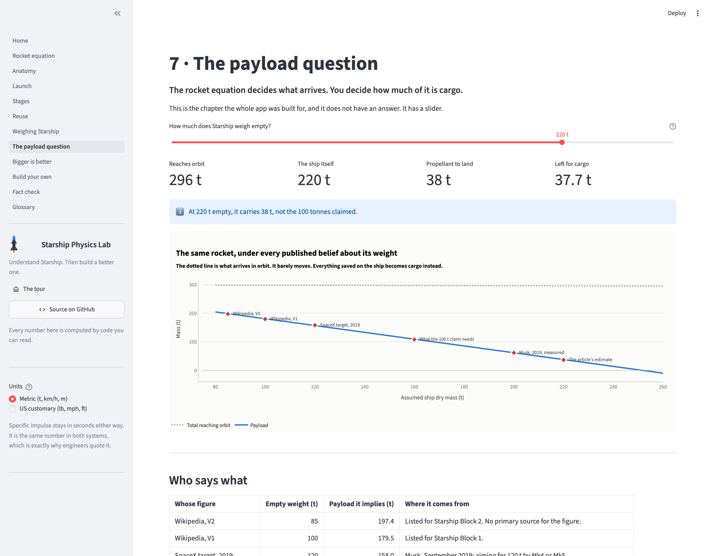
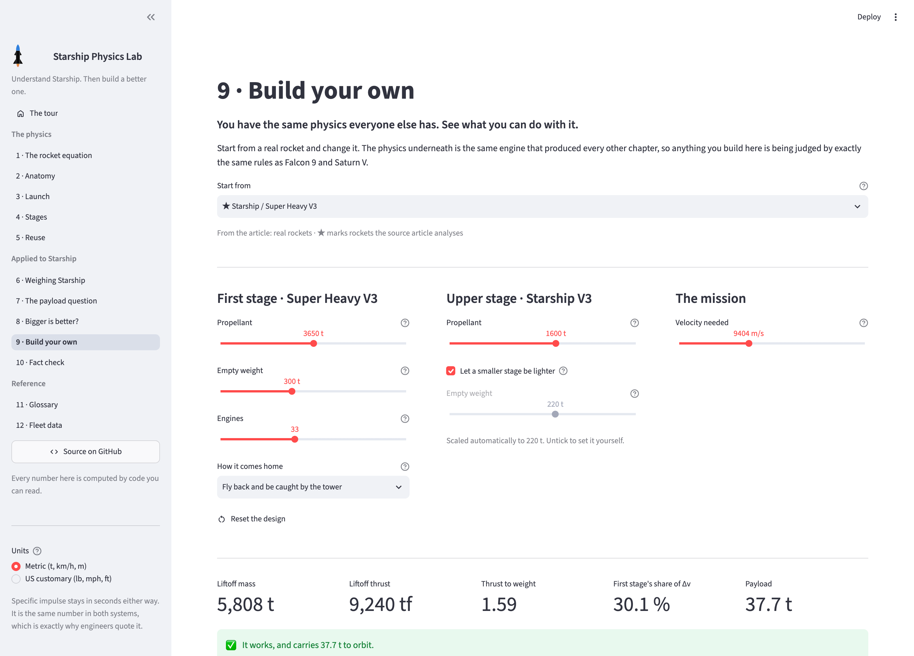

# Starship Physics Lab

### Understand Starship. Then build a better one.

**Rocket science, minus the reputation.** Almost everything that matters follows from one equation written down in 1903, and one uncomfortable fact: the propellant you need grows *exponentially* with the speed you want.

This is not a lecture with sliders bolted on. Every number on every page runs through a real, tested physics engine. Move one and watch it propagate.

## → [**Open the app**](https://mbackschat.github.io/starship-physics-lab/) ←

### [mbackschat.github.io/starship-physics-lab](https://mbackschat.github.io/starship-physics-lab/)

No install, no sign-up, no server. The whole thing runs in your browser.

[](https://mbackschat.github.io/starship-physics-lab/)

*The launch simulator. Pick a rocket, choose how hard to pitch it over, and watch where its velocity actually goes: a Falcon 9's engines produce 9,386 m/s, but only 7,579 m/s of that ever becomes speed. Gravity takes 17 %, steering 2 %, air 0.2 %. Fly it badly and it crashes, and the page tells you why.*

[](https://mbackschat.github.io/starship-physics-lab/)

*Chapter 4. The same 5,850 tonne rocket every time; only the speed at which the two stages separate changes. The payload optimum sits near 11,500 km/h. Starship separates at 6,000 km/h, which costs it 69 tonnes.*

[](https://mbackschat.github.io/starship-physics-lab/)

*Chapter 7, the one the app was built for. The dotted line is the mass reaching orbit: it barely moves, because the rocket equation fixes it. The falling line is how much of that is cargo. Every published estimate of Starship's empty weight is marked, and they disagree by enough to change the answer from 37 tonnes to 180. The app hands you the slider rather than a verdict.*

## What you can work out for yourself

- **Why going fast is so expensive.** One tonne of rocket needs 1, 3, 7 then 15 tonnes of propellant for 1x, 2x, 3x and 4x the speed. The speed climbs in equal steps; the propellant doubles every time.
- **How little of a rocket is cargo.** Under 1 % of what leaves the pad. That is not a design failure, it is what the equation demands.
- **Where a launch's velocity goes.** Roughly a fifth never becomes speed at all.
- **What reuse costs.** Super Heavy carries 330 tonnes of propellant to orbit purely so it can come home again.
- **Whether Starship really carries 100 tonnes.** The rocket equation fixes about 300 t arriving in orbit no matter what. Whether 40 t or 100 t of that is cargo depends on one number SpaceX has not published since 2019. The app hands you that slider rather than the answer.

Units switch between metric and US customary anywhere, in the app and in generated reports.

[](https://mbackschat.github.io/starship-physics-lab/)

*Chapter 9. Reshape either stage, choose how the booster comes home, and get scored against Falcon 9, Saturn V and New Glenn on the fairest single measure: how much of what left the pad turned out to be useful.*

## Where this came from

In August 2026 a German article argued that Starship carries far less payload than claimed. Before building anything on it, every number in it was recomputed independently: **61 of 64 checkable numbers reproduce within 2 %**, and the three that do not are recorded as corrections rather than quietly fixed.

Then the central claim was rebuilt from scratch rather than taken on trust. Sweeping the staging speed on the same 5,850 t rocket puts the payload optimum near 11,500 km/h against the 6,000 km/h Starship actually flies, **worth roughly 2.2x the payload**.

The full verification log, the corrections and the sources are in [docs/physics-reference.md](docs/physics-reference.md).

Nothing here asserts a verdict. Chapters 1 to 5 teach the mechanics with no agenda; the Starship case study shows its uncertainty and lets you reach your own conclusion. Every number in the library is labelled **published**, **estimated** or **contested**, and the contested one is the one the whole argument turns on.

## Also a workbench

The app is one consumer of the physics core. A person, or a coding agent, is the other. Ask a question, get a table, a chart and a CSV:

```python
from labbook import Col, Quantity, table
from labbook.units import US                 # or METRIC
from rocketry.library import load
from rocketry.vehicle import analyse

lib = load()
rows = [analyse(lib, k) for k in ("starship_v3", "falcon9_droneship")]
print(table(rows, [
    Col("name", "Vehicle"),
    Col("total_delta_v", "Ideal delta-v", Quantity.VELOCITY),
    Col("payload_t", "Payload", Quantity.MASS, digits=1),
], formatter=US))
```

Each investigation lives in [`studies/`](studies/), one folder holding the script, the written finding and its figures, so understanding accumulates in the repository instead of evaporating in a chat log.

## Status

Every milestone in [docs/plan.md](docs/plan.md) is complete.

| | |
|---|---|
| done | **M0-M2** Scaffold, physics core, rocket library |
| done | **M2c** Analysis workbench: units, tables, charts, export |
| done | **M3-M6** App shell, chapters 1-8, ascent simulation, the Starship case study |
| done | **M8a** Live on GitHub Pages |
| done | **M2b** More presets: Saturn V, New Glenn, Long March 10B, a properly modelled Ariane 64 |
| done | **M7** The build-your-own sandbox |
| done | **M8a** Fact check and glossary chapters |
| done | **M8b** Guided tour, shareable links, dark mode locked by tests |

262 tests, `ruff` and `mypy --strict` clean, all green in CI before anything deploys. Full plan in [docs/plan.md](docs/plan.md).

## How it runs in a browser

GitHub Pages serves static files, and browsers only execute JavaScript and WebAssembly. Python works because **[Pyodide](https://pyodide.org) is CPython itself compiled to WebAssembly**, and [stlite](https://github.com/whitphx/stlite) packages Streamlit for it. Your browser downloads the interpreter once, then runs the very same `.py` files that run locally. Nothing is sent anywhere.

That imposes one useful discipline: every runtime dependency is a wheel the reader has to download. `scipy` and `ambiance` were dropped in favour of a forty-line standard atmosphere and a hand-written RK4 integrator, which took about 15 MB out of the bundle.

It also costs one piece of plumbing. Streamlit writes the current chapter into the address bar, but a static host has no route for those paths and the browser runtime never shows the path to Python: it reports its own mount point as the URL and forwards only the query string. So the build writes its page twice, as `index.html` and as the `404.html` that answers every unmatched path, and that page moves the chapter out of the path and into the query string before Python starts. Without it, every link the app produces answers with GitHub's error page: reload a chapter, bookmark one, or share one, and it dies.

## Layout

```
src/rocketry/   physics core. SI throughout. no UI dependencies. fully tested
src/labbook/    presentation: units, palette, tables, charts, export
app/            Streamlit front end, thin glue over the two above
data/           the rocket library as editable YAML, every entry sourced
studies/        one folder per question: script, finding, figures
deploy/         static site build, browser acceptance checks, screenshots
```

Two rules that do not bend:

1. `src/rocketry/` never imports Streamlit, Plotly, pandas or `labbook`.
2. `src/rocketry/` is SI throughout. Units convert once, at the edge. A unit bug can change a label but never a result.

## Development

```sh
uv sync                                          # install
uv run pytest                                    # 262 tests
uv run ruff check . && uv run mypy               # lint and types
uv run streamlit run app/Home.py                 # the app, locally

uv run python studies/staging-split/run.py       # answer a question
uv run python deploy/build.py                    # build the static site
uv run playwright install chromium               # once, for the browser checks
uv run python deploy/acceptance.py --local       # drive the built site in a browser
uv run python deploy/screenshot.py               # refresh the README images
```

`deploy/acceptance.py --local` serves the built site the way GitHub Pages does and drives it in a real browser: every chapter renders, a shared link opens its chapter on its setting, a reload stays put, and a hand-edited URL falls back rather than breaking. Drop `--local` to run the same checks against the deployed site. It is the only check that sees what a reader sees, so run it before trusting a green test suite about anything user-facing.

## Provenance

Analysis began from ["SpaceX: Wie das Starship den Kampf gegen die Physik verliert"](https://www.golem.de/news/spacex-wie-das-starship-den-kampf-gegen-die-physik-verliert-2608-211916.html), Golem.de, 14 August 2026. The article itself is not redistributed here; it is cited by link, and every number taken from it was verified first. See [docs/physics-reference.md](docs/physics-reference.md) section 3 for the claim-by-claim log and section 10 for sources.
